# RejectionRoulette

RejectionRoulette is a cross-platform desktop app for tracking job applications, interviews, and offers. 
Built with Rust and Dioxus, it runs on Linux, Windows, and macOS.

## Features

- Track job applications with company, role, status, and submission date
- Record interview details and notes for each application
- Manage offers including salary, bonus, equity, expiration date, and acceptance status
- Cross-platform support for Linux, Windows, and macOS

## Screenshots

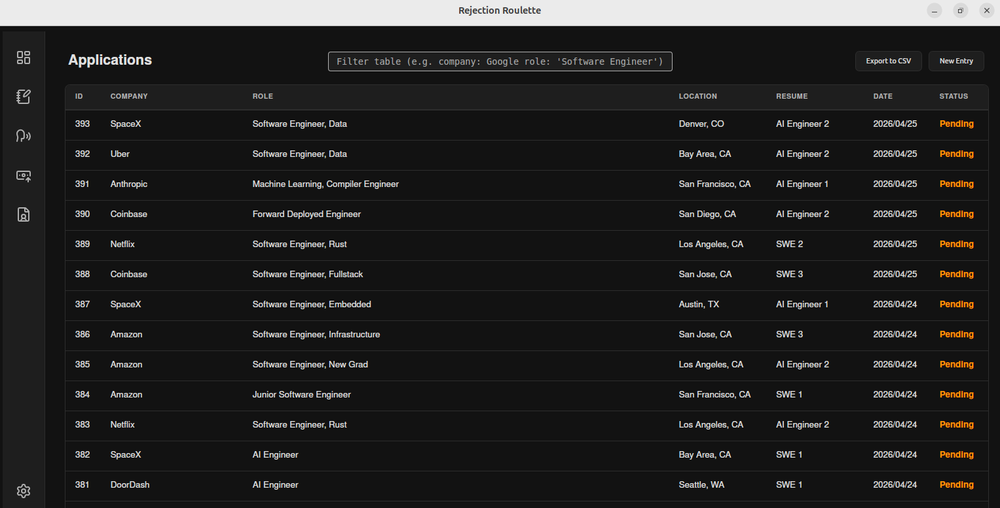
*Applications table showing job applications with company, role, status, and submission dates*

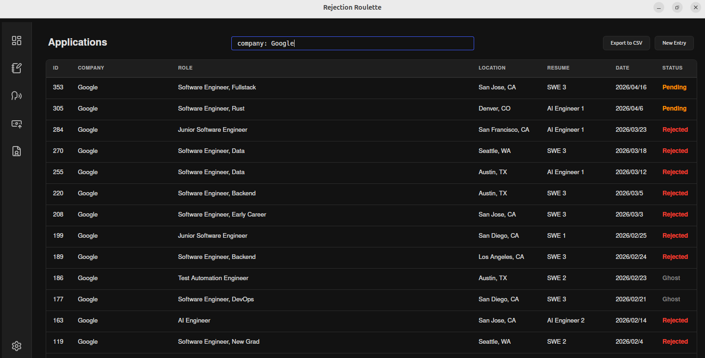
*Filter job applications by company (Google)*

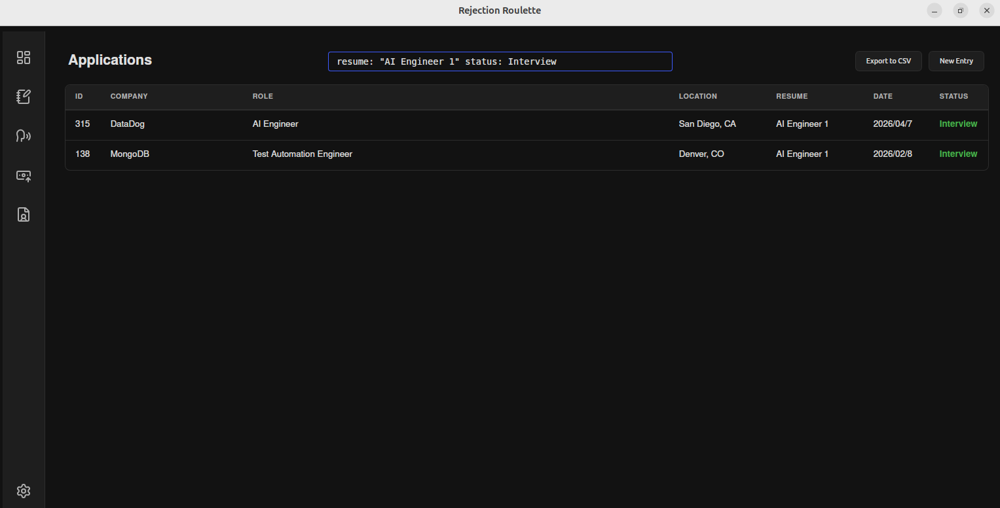
*Filter job applications by resume and status (Interview)*

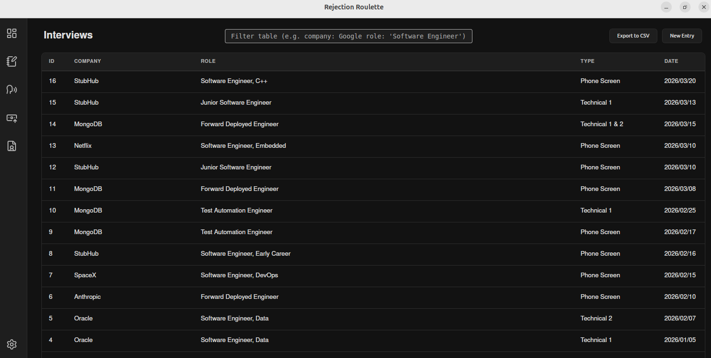
*Interview tracking view with details and notes for each application*

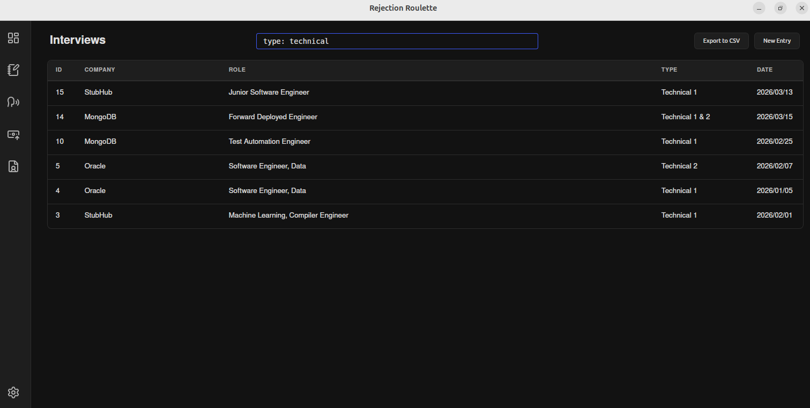
*Filter interviews by type*

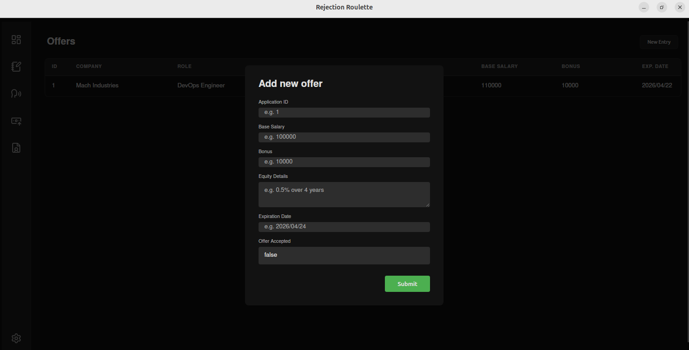
*Offers management showing salary, bonus, equity details, and acceptance status*

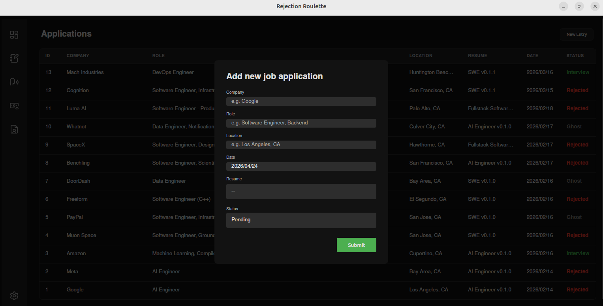
*Add new job application form*

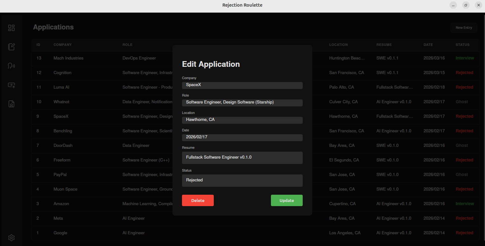
*Edit existing application form*

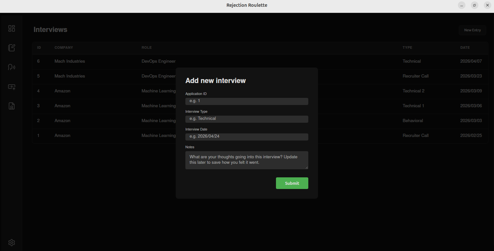
*Add interview details form*

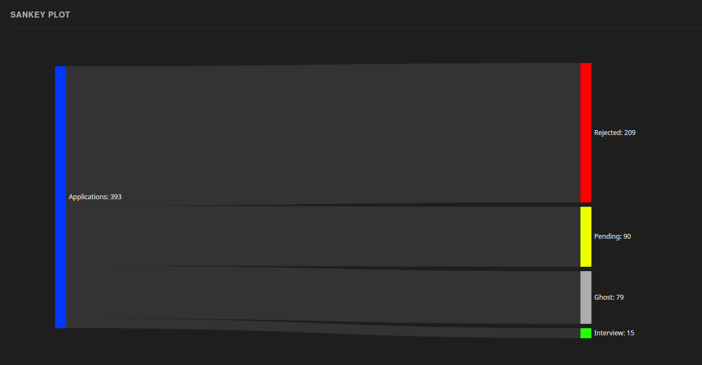
*Sankey diagram showing application flow*

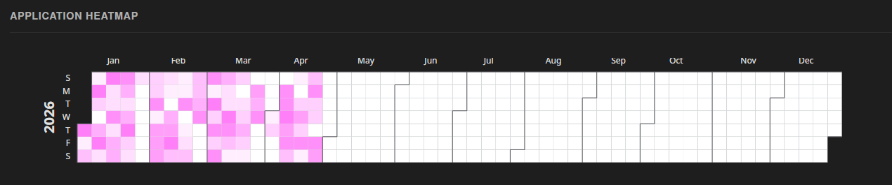
*Calendar heatmap showing application submission by day*

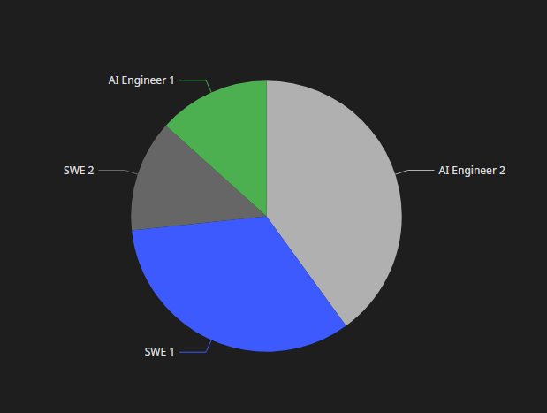
*Pie chart showing interview distribution by resume*

### Themes
The app comes with multiple themes. Check out some of them below.

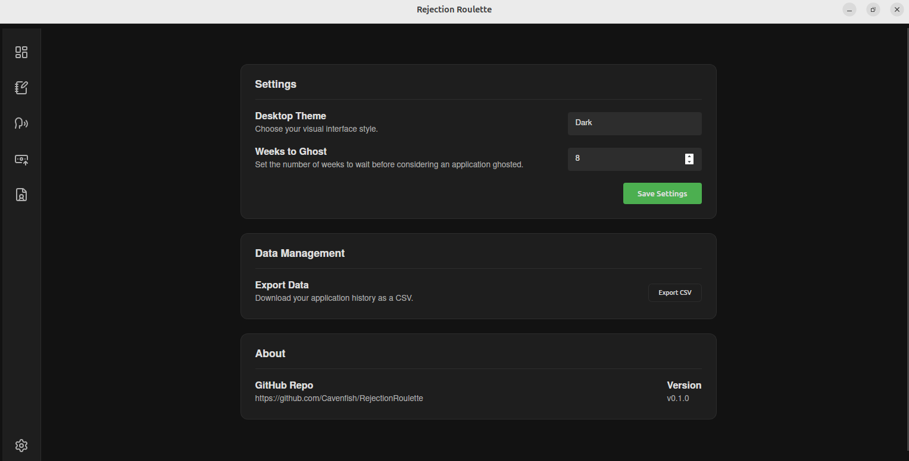
*Dark theme*

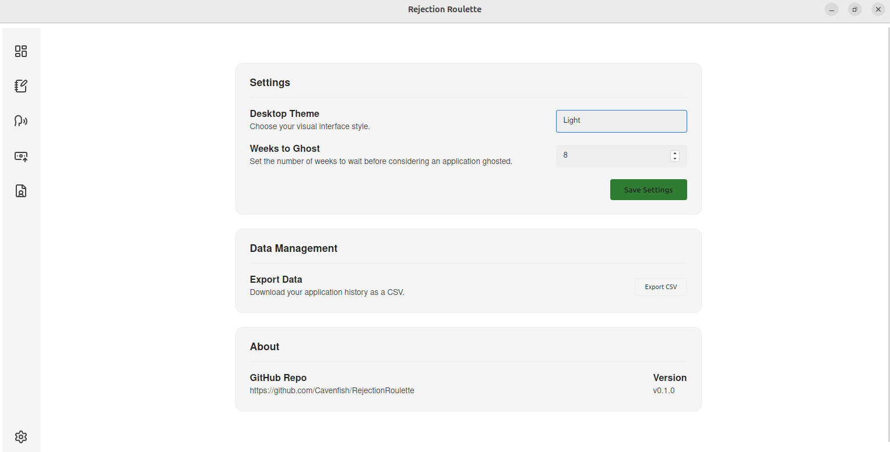
*Light theme*

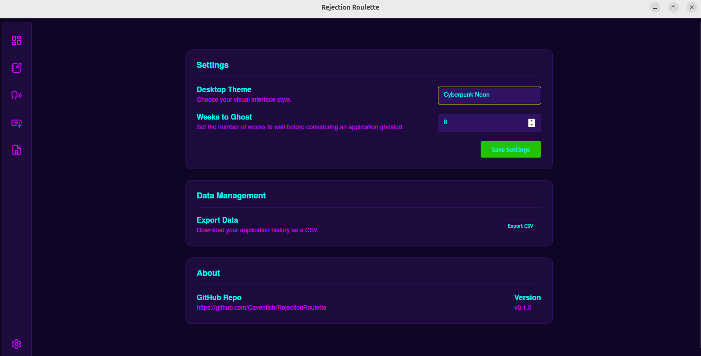
*Cyberpunk theme*

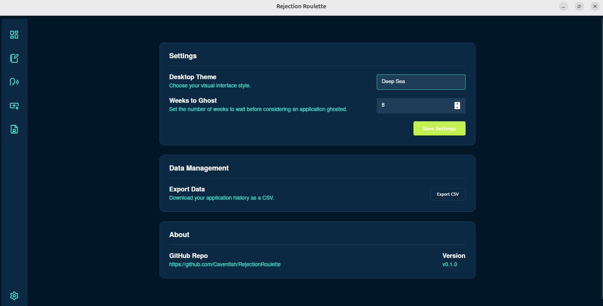
*Deep sea theme*

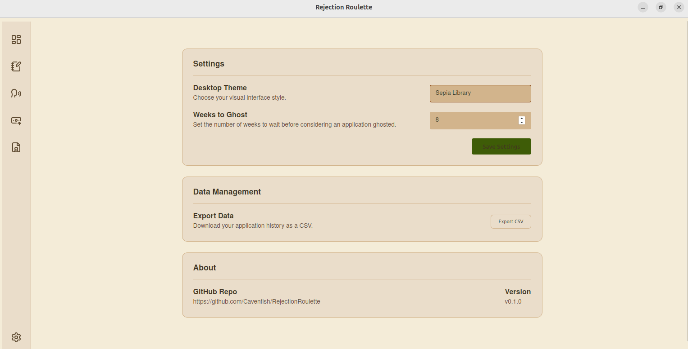
*Sepia theme*

## Installation

### Linux

Use the `.deb` bundle produced by the build pipeline or install from source.

### Windows

Use the `.msi` installer produced by the build pipeline.

### macOS

Use the `.dmg` installer produced by the build pipeline.

## Development

### Requirements

- Rust toolchain
- `dioxus-cli`
- Platform-specific GTK/WebKit dependencies for desktop bundling on Linux

